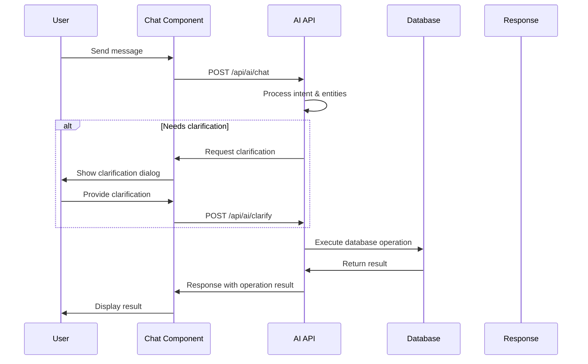
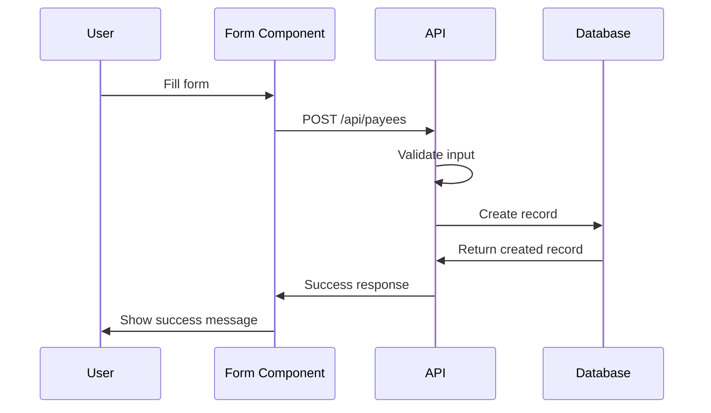

# API Design & Data Flow

## Overview

The API layer provides RESTful endpoints for all application functionality, including AI processing, payee management, and category operations. All endpoints follow consistent patterns for authentication, validation, and error handling.

## API Structure

### Base URL

```
/api/
├── ai/
│   ├── chat
│   ├── intent
│   └── clarify
├── payees/
│   ├── /
│   └── [id]
└── categories/
    ├── /
    └── [id]
```

## AI Endpoints

### 1. AI Chat Endpoint

**Route**: `POST /api/ai/chat`

**Purpose**: Main AI conversation endpoint for natural language processing.

**Request Interface**:

```typescript
interface ChatRequest {
  message: string;
  conversationId?: string;
  context?: {
    currentPayees?: Payee[];
    currentCategories?: Category[];
    recentActions?: Action[];
  };
}
```

**Response Interface**:

```typescript
interface ChatResponse {
  response: string;
  intent: Intent;
  entities: ExtractedEntity[];
  requiresClarification: boolean;
  clarificationQuestions?: ClarificationQuestion[];
  suggestedActions?: SuggestedAction[];
  executedOperations?: ExecutedOperation[];
  conversationId: string;
  confidence: number;
}
```

**Example Usage**:

```typescript
// Request
{
  "message": "Add a new vendor called ABC Corp with email contact@abc.com",
  "conversationId": "conv_123",
  "context": {
    "currentCategories": [
      { "id": "cat_1", "name": "Vendors" }
    ]
  }
}

// Response
{
  "response": "I've created a new vendor 'ABC Corp' with email contact@abc.com in the Vendors category.",
  "intent": "CREATE_PAYEE",
  "entities": [
    { "type": "name", "value": "ABC Corp", "confidence": 0.98 },
    { "type": "email", "value": "contact@abc.com", "confidence": 0.99 }
  ],
  "requiresClarification": false,
  "executedOperations": [
    {
      "type": "CREATE_PAYEE",
      "result": { "id": "payee_456", "name": "ABC Corp", "email": "contact@abc.com" }
    }
  ],
  "conversationId": "conv_123",
  "confidence": 0.95
}
```

### 2. Intent Classification Endpoint

**Route**: `POST /api/ai/intent`

**Purpose**: Standalone intent classification for message analysis.

**Request Interface**:

```typescript
interface IntentRequest {
  message: string;
  context?: any;
}
```

**Response Interface**:

```typescript
interface IntentResponse {
  intent: Intent;
  confidence: number;
  reasoning: string;
  alternatives?: { intent: Intent; confidence: number }[];
}
```

### 3. Clarification Endpoint

**Route**: `POST /api/ai/clarify`

**Purpose**: Handle clarification responses and continue conversations.

**Request Interface**:

```typescript
interface ClarificationRequest {
  conversationId: string;
  clarificationResponse: any;
  originalMessage: string;
}
```

**Response Interface**:

```typescript
interface ClarificationResponse {
  response: string;
  resolved: boolean;
  nextSteps?: string[];
  executedOperations?: ExecutedOperation[];
}
```

## Payee Management Endpoints

### 1. List Payees

**Route**: `GET /api/payees`

**Query Parameters**:

```typescript
interface PayeeQuery {
  page?: number;
  limit?: number;
  search?: string;
  category_id?: string;
  is_active?: boolean;
  sort_by?: 'name' | 'created_at' | 'updated_at';
  sort_order?: 'asc' | 'desc';
}
```

**Response Interface**:

```typescript
interface PayeeListResponse {
  payees: Payee[];
  pagination: {
    page: number;
    limit: number;
    total: number;
    totalPages: number;
  };
  filters: {
    search?: string;
    category_id?: string;
    is_active?: boolean;
  };
}
```

### 2. Create Payee

**Route**: `POST /api/payees`

**Request Interface**:

```typescript
interface CreatePayeeRequest {
  name: string;
  email?: string;
  phone?: string;
  address?: string;
  tax_id?: string;
  category_id?: string;
}
```

**Response Interface**:

```typescript
interface CreatePayeeResponse {
  payee: Payee;
  message: string;
}
```

### 3. Get Payee

**Route**: `GET /api/payees/[id]`

**Response Interface**:

```typescript
interface PayeeResponse {
  payee: Payee;
  category?: Category;
  recentTransactions?: Transaction[];
}
```

### 4. Update Payee

**Route**: `PUT /api/payees/[id]`

**Request Interface**:

```typescript
interface UpdatePayeeRequest {
  name?: string;
  email?: string;
  phone?: string;
  address?: string;
  tax_id?: string;
  category_id?: string;
  is_active?: boolean;
}
```

### 5. Delete Payee

**Route**: `DELETE /api/payees/[id]`

**Request Interface**:

```typescript
interface DeletePayeeRequest {
  soft_delete?: boolean; // Default: true
}
```

## Category Management Endpoints

### 1. List Categories

**Route**: `GET /api/categories`

**Query Parameters**:

```typescript
interface CategoryQuery {
  parent_id?: string | null; // null for root categories
  include_children?: boolean;
  depth?: number;
  is_active?: boolean;
  sort_by?: 'name' | 'created_at';
}
```

**Response Interface**:

```typescript
interface CategoryListResponse {
  categories: CategoryWithChildren[];
  hierarchy: CategoryHierarchy;
}

interface CategoryWithChildren extends Category {
  children?: CategoryWithChildren[];
  payee_count?: number;
}
```

### 2. Create Category

**Route**: `POST /api/categories`

**Request Interface**:

```typescript
interface CreateCategoryRequest {
  name: string;
  description?: string;
  parent_id?: string;
  color?: string;
}
```

### 3. Update Category

**Route**: `PUT /api/categories/[id]`

**Request Interface**:

```typescript
interface UpdateCategoryRequest {
  name?: string;
  description?: string;
  parent_id?: string;
  color?: string;
  is_active?: boolean;
}
```

### 4. Delete Category

**Route**: `DELETE /api/categories/[id]`

**Query Parameters**:

```typescript
interface DeleteCategoryQuery {
  cascade?: boolean; // Delete children too
  reassign_to?: string; // Reassign payees to another category
}
```

## Data Flow Patterns

### 1. AI-Driven Operations



### 2. Direct CRUD Operations



## Error Handling

### 1. Error Response Format

```typescript
interface ErrorResponse {
  error: {
    code: string;
    message: string;
    details?: any;
    field?: string; // For validation errors
  };
  timestamp: string;
  path: string;
}
```

### 2. HTTP Status Codes

- `200` - Success
- `201` - Created
- `400` - Bad Request (validation errors)
- `401` - Unauthorized
- `403` - Forbidden
- `404` - Not Found
- `409` - Conflict (duplicate names, etc.)
- `422` - Unprocessable Entity (business logic errors)
- `429` - Too Many Requests (rate limiting)
- `500` - Internal Server Error

### 3. Error Examples

```typescript
// Validation Error
{
  "error": {
    "code": "VALIDATION_ERROR",
    "message": "Email address is invalid",
    "field": "email"
  },
  "timestamp": "2024-01-15T10:30:00Z",
  "path": "/api/payees"
}

// Business Logic Error
{
  "error": {
    "code": "DUPLICATE_NAME",
    "message": "A payee with this name already exists",
    "details": {
      "existing_payee_id": "payee_123"
    }
  },
  "timestamp": "2024-01-15T10:30:00Z",
  "path": "/api/payees"
}
```

## Request/Response Middleware

### 1. Authentication Middleware

```typescript
interface AuthMiddleware {
  validateToken(req: Request): Promise<User>;
  extractUserId(req: Request): string;
}
```

### 2. Validation Middleware

```typescript
interface ValidationMiddleware {
  validatePayeeInput(data: any): ValidationResult;
  validateCategoryInput(data: any): ValidationResult;
  sanitizeInput(data: any): any;
}
```

### 3. Rate Limiting

```typescript
interface RateLimitConfig {
  ai_chat: { requests: 60; window: '1m' };
  payee_operations: { requests: 100; window: '1m' };
  category_operations: { requests: 100; window: '1m' };
}
```

## Caching Strategy

### 1. Response Caching

```typescript
interface CacheConfig {
  categories: {
    ttl: 300, // 5 minutes
    key: (userId: string) => `categories:${userId}`
  };
  payees_list: {
    ttl: 60, // 1 minute
    key: (userId: string, params: any) => `payees:${userId}:${hashParams(params)}`
  };
  ai_responses: {
    ttl: 3600, // 1 hour
    key: (message: string, context: any) => `ai:${hashMessage(message, context)}`
  };
}
```

### 2. Cache Invalidation

```typescript
interface CacheInvalidation {
  onPayeeCreate: (userId: string) => void;
  onPayeeUpdate: (userId: string, payeeId: string) => void;
  onCategoryCreate: (userId: string) => void;
  onCategoryUpdate: (userId: string, categoryId: string) => void;
}
```

## API Security

### 1. Input Sanitization

```typescript
interface SecurityMiddleware {
  sanitizeHTML(input: string): string;
  validateSQLInjection(input: string): boolean;
  rateLimitByUser(userId: string): boolean;
}
```

### 2. Row Level Security

```typescript
interface RLSPolicy {
  table: string;
  policy: string;
  condition: (userId: string) => string;
}

const RLS_POLICIES: RLSPolicy[] = [
  {
    table: 'payees',
    policy: 'user_isolation',
    condition: (userId) => `user_id = '${userId}'`,
  },
  {
    table: 'categories',
    policy: 'user_isolation',
    condition: (userId) => `user_id = '${userId}'`,
  },
];
```

## API Documentation

### 1. OpenAPI Specification

```yaml
openapi: 3.0.0
info:
  title: AI Side Panel API
  version: 1.0.0
  description: API for AI-powered payee and category management

paths:
  /api/ai/chat:
    post:
      summary: Process AI chat message
      requestBody:
        required: true
        content:
          application/json:
            schema:
              $ref: '#/components/schemas/ChatRequest'
      responses:
        200:
          description: Successful response
          content:
            application/json:
              schema:
                $ref: '#/components/schemas/ChatResponse'
```

### 2. Type Definitions Export

```typescript
// Export all API types for frontend consumption
export * from './types/api';
export * from './types/payee';
export * from './types/category';
export * from './types/ai';
```

## Performance Monitoring

### 1. API Metrics

```typescript
interface APIMetrics {
  endpoint: string;
  method: string;
  avg_response_time: number;
  request_count: number;
  error_rate: number;
  cache_hit_rate: number;
}
```

### 2. Monitoring Endpoints

```typescript
// Health check
GET / api / health;

// Metrics
GET / api / metrics;

// Database status
GET / api / status / database;
```
